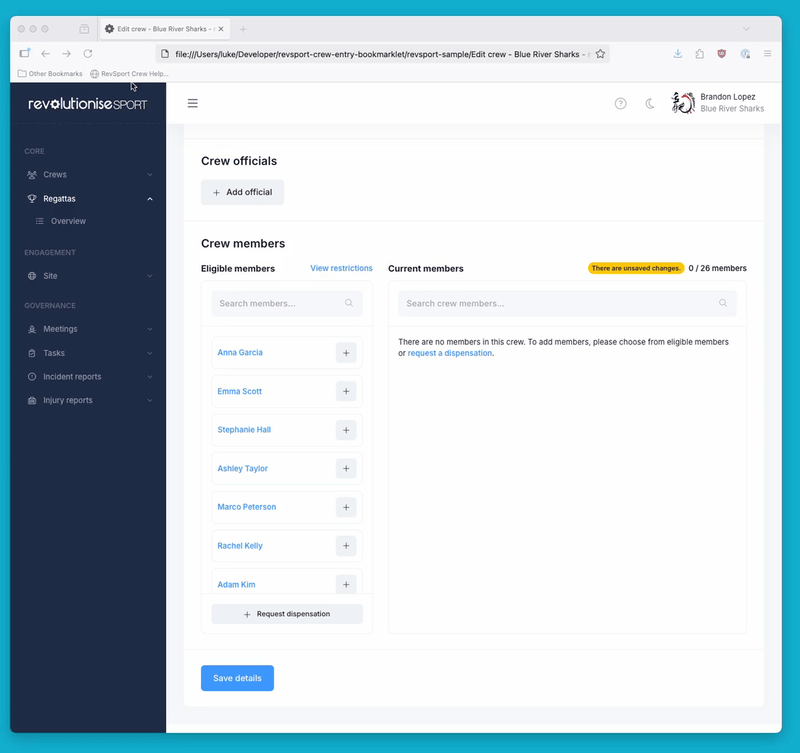

# RevSport Crew Entry Bookmarklet

A helpful bookmarklet that allows revolutioniseSPORT users quickly add multiple athletes into to regatta crews by matching names intelligently and remembering user preferences.

## Features

- **Smart Name Matching**: Uses several strategies to match names even with variations, typos, or partial names
- **Bulk Operations**: Add multiple crew members at once by pasting a list of names
- **User Memory**: Remembers your name mapping choices for future use
- **Flexible Selection**: Manual override options for all matches
- **Clean Interface**: Modal overlay that doesn't interfere with the existing page



## Installation

**Installation Instructions:**

<!-- BOOKMARKLET_START -->
1. Copy the bookmarklet code from below
2. Create a new bookmark in your browser
3. Set the name to "RevSport Crew Helper"
4. Paste the code as the URL/location
5. Save the bookmark
<!-- BOOKMARKLET_END -->

Copy the code below:

<!-- BOOKMARKLET_CODE_START -->
```
javascript:var%20bookmarklet%3B(()%3D%3E%7Bvar%20e%3D%7B56%3A(e%2Ct%2Cn)%3D%3E%7B%22use%20strict%22%3Be.exports%3Dfunction(e)%7Bvar%20t%3Dn.nc%3Bt%26%26e.setAttribute(%22nonce%22%2Ct)%7D%7D%2C72%3Ae%3D%3E%7B%22use%20strict%22%3Bvar%20t%3D%5B%5D%3Bfunction%20n(e)%7Bfor(var%20n%3D-1%2Cr%3D0%3Br%3Ct.length%3Br%2B%2B)if(t%5Br%5D.identifier%3D%3D%3De)%7Bn%3Dr%3Bbreak%7Dreturn%20n%7Dfunction%20r(e%2Cr)%7Bfor(var%20o%3D%7B%7D%2Ci%3D%5B%5D%2Cc%3D0%3Bc%3Ce.length%3Bc%2B%2B)%7Bvar%20l%3De%5Bc%5D%2Cs%3Dr.base%3Fl%5B0%5D%2Br.base%3Al%5B0%5D%2Cd%3Do%5Bs%5D%7C%7C0%2Cu%3D%22%22.concat(s%2C%22%20%22).concat(d)%3Bo%5Bs%5D%3Dd%2B1%3Bvar%20p%3Dn(u)%2Cm%3D%7Bcss%3Al%5B1%5D%2Cmedia%3Al%5B2%5D%2CsourceMap%3Al%5B3%5D%2Csupports%3Al%5B4%5D%2Clayer%3Al%5B5%5D%7D%3Bif(-1!%3D%3Dp)t%5Bp%5D.references%2B%2B%2Ct%5Bp%5D.updater(m)%3Belse%7Bvar%20f%3Da(m%2Cr)%3Br.byIndex%3Dc%2Ct.splice(c%2C0%2C%7Bidentifier%3Au%2Cupdater%3Af%2Creferences%3A1%7D)%7Di.push(u)%7Dreturn%20i%7Dfunction%20a(e%2Ct)%7Bvar%20n%3Dt.domAPI(t)%3Bn.update(e)%3Breturn%20function(t)%7Bif(t)%7Bif(t.css%3D%3D%3De.css%26%26t.media%3D%3D%3De.media%26%26t.sourceMap%3D%3D%3De.sourceMap%26%26t.supports%3D%3D%3De.supports%26%26t.layer%3D%3D%3De.layer)return%3Bn.update(e%3Dt)%7Delse%20n.remove()%7D%7De.exports%3Dfunction(e%2Ca)%7Bvar%20o%3Dr(e%3De%7C%7C%5B%5D%2Ca%3Da%7C%7C%7B%7D)%3Breturn%20function(e)%7Be%3De%7C%7C%5B%5D%3Bfor(var%20i%3D0%3Bi%3Co.length%3Bi%2B%2B)%7Bvar%20c%3Dn(o%5Bi%5D)%3Bt%5Bc%5D.references--%7Dfor(var%20l%3Dr(e%2Ca)%2Cs%3D0%3Bs%3Co.length%3Bs%2B%2B)%7Bvar%20d%3Dn(o%5Bs%5D)%3B0%3D%3D%3Dt%5Bd%5D.references%26%26(t%5Bd%5D.updater()%2Ct.splice(d%2C1))%7Do%3Dl%7D%7D%7D%2C113%3Ae%3D%3E%7B%22use%20strict%22%3Be.exports%3Dfunction(e%2Ct)%7Bif(t.styleSheet)t.styleSheet.cssText%3De%3Belse%7Bfor(%3Bt.firstChild%3B)t.removeChild(t.firstChild)%3Bt.appendChild(document.createTextNode(e))%7D%7D%7D%2C131%3A(e%2Ct%2Cn)%3D%3E%7B%22use%20strict%22%3Bn.d(t%2C%7BA%3A()%3D%3Ec%7D)%3Bvar%20r%3Dn(601)%2Ca%3Dn.n(r)%2Co%3Dn(314)%2Ci%3Dn.n(o)()(a())%3Bi.push(%5Be.id%2C%22%2F*%20RevSport%20Bookmarklet%20Button%20Styles%20*%2F%5Cn.revsport-bookmarklet-btn%20%7B%5Cn%20%20border%3A%20none%3B%5Cn%20%20padding%3A%2012px%2024px%3B%5Cn%20%20border-radius%3A%205px%3B%5Cn%20%20font-size%3A%2016px%3B%5Cn%20%20cursor%3A%20pointer%3B%5Cn%20%20margin%3A%2010px%3B%5Cn%20%20transition%3A%20background%200.3s%3B%5Cn%7D%5Cn%5Cn.revsport-bookmarklet-btn-danger%20%7B%5Cn%20%20background%3A%20%23dc3545%3B%5Cn%20%20color%3A%20white%3B%5Cn%7D%5Cn%5Cn.revsport-bookmarklet-btn-danger%3Ahover%20%7B%5Cn%20%20background%3A%20%23c82333%3B%5Cn%7D%5Cn%5Cn.revsport-bookmarklet-btn-secondary%20%7B%5Cn%20%20background%3A%20%236c757d%3B%5Cn%20%20color%3A%20white%3B%5Cn%7D%5Cn%5Cn.revsport-bookmarklet-btn-secondary%3Ahover%20%7B%5Cn%20%20background%3A%20%235a6268%3B%5Cn%7D%5Cn%5Cn.revsport-bookmarklet-btn-primary%20%7B%5Cn%20%20background%3A%20%23007bff%3B%5Cn%20%20color%3A%20white%3B%5Cn%20%20margin-left%3A%200px%3B%5Cn%7D%5Cn%5Cn.revsport-bookmarklet-btn-primary%3Ahover%20%7B%5Cn%20%20background%3A%20%230056b3%3B%5Cn%7D%5Cn%5Cn.revsport-bookmarklet-btn-success%20%7B%5Cn%20%20background%3A%20%2328a745%3B%5Cn%20%20color%3A%20white%3B%5Cn%20%20width%3A%20100%25%3B%5Cn%7D%5Cn%5Cn.revsport-bookmarklet-btn-success%3Ahover%20%7B%5Cn%20%20background%3A%20%23218838%3B%5Cn%7D%5Cn%5Cn.revsport-bookmarklet-overlay%20%7B%5Cn%20%20%20%20%20%20position%3A%20fixed%3B%5Cn%20%20%20%20%20%20top%3A%200%3B%5Cn%20%20%20%20%20%20left%3A%200%3B%5Cn%20%20%20%20%20%20width%3A%20100%25%3B%5Cn%20%20%20%20%20%20height%3A%20100%25%3B%5Cn%20%20%20%20%20%20background%3A%20rgba(0%2C%200%2C%200%2C%200.5)%3B%5Cn%20%20%20%20%20%20z-index%3A%2010000%3B%5Cn%20%20%20%20%20%20display%3A%20flex%3B%5Cn%20%20%20%20%20%20justify-content%3A%20center%3B%5Cn%20%20%20%20%20%20align-items%3A%20center%3B%5Cn%20%20%20%20%20%20font-family%3A%20Arial%2C%20sans-serif%3B%5Cn%7D%5Cn%5Cn.revsport-bookmarklet-modal%20%7B%5Cn%20%20%20%20background%3A%20white%3B%5Cn%20%20%20%20padding%3A%2030px%3B%5Cn%20%20%20%20border-radius%3A%2010px%3B%5Cn%20%20%20%20box-shadow%3A%200%204px%2020px%20rgba(0%2C%200%2C%200%2C%200.3)%3B%5Cn%20%20%20%20text-align%3A%20center%3B%5Cn%20%20%20%20max-width%3A%20600px%3B%5Cn%20%20%20%20width%3A%2090%25%3B%5Cn%7D%5Cn%5Cn.revsport-bookmarklet-title%20%7B%5Cn%20%20%20%20margin%3A%200%200%2020px%200%3B%5Cn%20%20%20%20color%3A%20%23333%3B%5Cn%7D%5Cn%5Cn%2F*%20Bulk%20Add%20Section%20Styles%20*%2F%5Cn.revsport-bookmarklet-bulk-section%20%7B%5Cn%20%20%20%20margin-bottom%3A%2020px%3B%5Cn%20%20%20%20text-align%3A%20left%3B%5Cn%7D%5Cn%5Cn.revsport-bookmarklet-stats%20%7B%5Cn%20%20%20%20background%3A%20%23f0f8ff%3B%5Cn%20%20%20%20padding%3A%208px%3B%5Cn%20%20%20%20border-radius%3A%205px%3B%5Cn%20%20%20%20margin-top%3A%2010px%3B%5Cn%20%20%20%20font-size%3A%2012px%3B%5Cn%20%20%20%20color%3A%20%23666%3B%5Cn%7D%5Cn%5Cn.revsport-bookmarklet-textarea%20%7B%5Cn%20%20%20%20width%3A%20100%25%3B%5Cn%20%20%20%20height%3A%20120px%3B%5Cn%20%20%20%20padding%3A%2010px%3B%5Cn%20%20%20%20border%3A%201px%20solid%20%23ddd%3B%5Cn%20%20%20%20border-radius%3A%205px%3B%5Cn%20%20%20%20font-size%3A%2014px%3B%5Cn%20%20%20%20resize%3A%20vertical%3B%5Cn%20%20%20%20margin-bottom%3A%2010px%3B%5Cn%20%20%20%20box-sizing%3A%20border-box%3B%5Cn%7D%5Cn%5Cn%5Cn.revsport-bookmarklet-results%20%7B%5Cn%20%20%20%20margin-top%3A%2015px%3B%5Cn%20%20%20%20max-height%3A%20400px%3B%5Cn%20%20%20%20overflow-y%3A%20auto%3B%5Cn%20%20%20%20border%3A%201px%20solid%20%23eee%3B%5Cn%20%20%20%20border-radius%3A%205px%3B%5Cn%20%20%20%20padding%3A%2010px%3B%5Cn%20%20%20%20display%3A%20none%3B%5Cn%7D%5Cn%5Cn.revsport-bookmarklet-match-item%20%7B%5Cn%20%20%20%20padding%3A%2010px%2012px%3B%5Cn%20%20%20%20margin-bottom%3A%208px%3B%5Cn%20%20%20%20border%3A%201px%20solid%20%23ddd%3B%5Cn%20%20%20%20border-radius%3A%205px%3B%5Cn%20%20%20%20background%3A%20%23f8f9fa%3B%5Cn%20%20%20%20display%3A%20flex%3B%5Cn%20%20%20%20align-items%3A%20center%3B%5Cn%20%20%20%20gap%3A%2010px%3B%5Cn%7D%5Cn%5Cn.revsport-bookmarklet-match-checkbox%20%7B%5Cn%20%20%20%20margin%3A%200%3B%5Cn%7D%5Cn%5Cn.revsport-bookmarklet-match-label%20%7B%5Cn%20%20%20%20min-width%3A%20120px%3B%5Cn%20%20%20%20font-weight%3A%20bold%3B%5Cn%20%20%20%20color%3A%20%23333%3B%5Cn%7D%5Cn%5Cn.revsport-bookmarklet-match-arrow%20%7B%5Cn%20%20%20%20color%3A%20%23999%3B%5Cn%7D%5Cn%5Cn.revsport-bookmarklet-match-select%20%7B%5Cn%20%20%20%20flex%3A%201%3B%5Cn%20%20%20%20padding%3A%205px%3B%5Cn%20%20%20%20border%3A%201px%20solid%20%23ddd%3B%5Cn%20%20%20%20border-radius%3A%203px%3B%5Cn%20%20%20%20font-size%3A%2014px%3B%5Cn%20%20%20%20max-width%3A%20300px%3B%5Cn%7D%5Cn%5Cn.revsport-bookmarklet-actions%20%7B%5Cn%20%20%20%20display%3A%20flex%3B%5Cn%20%20%20%20gap%3A%2010px%3B%5Cn%20%20%20%20padding-top%3A%2010px%3B%5Cn%20%20%20%20border-top%3A%201px%20solid%20%23eee%3B%5Cn%20%20%20%20margin-top%3A%2015px%3B%5Cn%7D%5Cn%5Cn%22%2C%22%22%5D)%3Bconst%20c%3Di%7D%2C314%3Ae%3D%3E%7B%22use%20strict%22%3Be.exports%3Dfunction(e)%7Bvar%20t%3D%5B%5D%3Breturn%20t.toString%3Dfunction()%7Breturn%20this.map(function(t)%7Bvar%20n%3D%22%22%2Cr%3Dvoid%200!%3D%3Dt%5B5%5D%3Breturn%20t%5B4%5D%26%26(n%2B%3D%22%40supports%20(%22.concat(t%5B4%5D%2C%22)%20%7B%22))%2Ct%5B2%5D%26%26(n%2B%3D%22%40media%20%22.concat(t%5B2%5D%2C%22%20%7B%22))%2Cr%26%26(n%2B%3D%22%40layer%22.concat(t%5B5%5D.length%3E0%3F%22%20%22.concat(t%5B5%5D)%3A%22%22%2C%22%20%7B%22))%2Cn%2B%3De(t)%2Cr%26%26(n%2B%3D%22%7D%22)%2Ct%5B2%5D%26%26(n%2B%3D%22%7D%22)%2Ct%5B4%5D%26%26(n%2B%3D%22%7D%22)%2Cn%7D).join(%22%22)%7D%2Ct.i%3Dfunction(e%2Cn%2Cr%2Ca%2Co)%7B%22string%22%3D%3Dtypeof%20e%26%26(e%3D%5B%5Bnull%2Ce%2Cvoid%200%5D%5D)%3Bvar%20i%3D%7B%7D%3Bif(r)for(var%20c%3D0%3Bc%3Cthis.length%3Bc%2B%2B)%7Bvar%20l%3Dthis%5Bc%5D%5B0%5D%3Bnull!%3Dl%26%26(i%5Bl%5D%3D!0)%7Dfor(var%20s%3D0%3Bs%3Ce.length%3Bs%2B%2B)%7Bvar%20d%3D%5B%5D.concat(e%5Bs%5D)%3Br%26%26i%5Bd%5B0%5D%5D%7C%7C(void%200!%3D%3Do%26%26(void%200%3D%3D%3Dd%5B5%5D%7C%7C(d%5B1%5D%3D%22%40layer%22.concat(d%5B5%5D.length%3E0%3F%22%20%22.concat(d%5B5%5D)%3A%22%22%2C%22%20%7B%22).concat(d%5B1%5D%2C%22%7D%22))%2Cd%5B5%5D%3Do)%2Cn%26%26(d%5B2%5D%3F(d%5B1%5D%3D%22%40media%20%22.concat(d%5B2%5D%2C%22%20%7B%22).concat(d%5B1%5D%2C%22%7D%22)%2Cd%5B2%5D%3Dn)%3Ad%5B2%5D%3Dn)%2Ca%26%26(d%5B4%5D%3F(d%5B1%5D%3D%22%40supports%20(%22.concat(d%5B4%5D%2C%22)%20%7B%22).concat(d%5B1%5D%2C%22%7D%22)%2Cd%5B4%5D%3Da)%3Ad%5B4%5D%3D%22%22.concat(a))%2Ct.push(d))%7D%7D%2Ct%7D%7D%2C367%3Ae%3D%3E%7Be.exports%3D%7BlevenshteinDistance%3Afunction(e%2Ct)%7Bif(e%3D%3D%3Dt)return%200%3Bif(0%3D%3D%3De.length)return%20t.length%3Bif(0%3D%3D%3Dt.length)return%20e.length%3Bfor(var%20n%3DArray(t.length%2B1).fill(null).map(function()%7Breturn%20Array(e.length%2B1).fill(0)%7D)%2Cr%3D0%3Br%3C%3De.length%3Br%2B%2B)n%5B0%5D%5Br%5D%3Dr%3Bfor(var%20a%3D0%3Ba%3C%3Dt.length%3Ba%2B%2B)n%5Ba%5D%5B0%5D%3Da%3Bfor(var%20o%3D1%3Bo%3C%3Dt.length%3Bo%2B%2B)for(var%20i%3D1%3Bi%3C%3De.length%3Bi%2B%2B)%7Bvar%20c%3De%5Bi-1%5D%3D%3D%3Dt%5Bo-1%5D%3F0%3A1%3Bn%5Bo%5D%5Bi%5D%3DMath.min(n%5Bo-1%5D%5Bi%5D%2B1%2Cn%5Bo%5D%5Bi-1%5D%2B1%2Cn%5Bo-1%5D%5Bi-1%5D%2Bc)%7Dreturn%20n%5Bt.length%5D%5Be.length%5D%7D%7D%7D%2C540%3Ae%3D%3E%7B%22use%20strict%22%3Be.exports%3Dfunction(e)%7Bvar%20t%3Ddocument.createElement(%22style%22)%3Breturn%20e.setAttributes(t%2Ce.attributes)%2Ce.insert(t%2Ce.options)%2Ct%7D%7D%2C601%3Ae%3D%3E%7B%22use%20strict%22%3Be.exports%3Dfunction(e)%7Breturn%20e%5B1%5D%7D%7D%2C659%3Ae%3D%3E%7B%22use%20strict%22%3Bvar%20t%3D%7B%7D%3Be.exports%3Dfunction(e%2Cn)%7Bvar%20r%3Dfunction(e)%7Bif(void%200%3D%3D%3Dt%5Be%5D)%7Bvar%20n%3Ddocument.querySelector(e)%3Bif(window.HTMLIFrameElement%26%26n%20instanceof%20window.HTMLIFrameElement)try%7Bn%3Dn.contentDocument.head%7Dcatch(e)%7Bn%3Dnull%7Dt%5Be%5D%3Dn%7Dreturn%20t%5Be%5D%7D(e)%3Bif(!r)throw%20new%20Error(%22Couldn't%20find%20a%20style%20target.%20This%20probably%20means%20that%20the%20value%20for%20the%20'insert'%20parameter%20is%20invalid.%22)%3Br.appendChild(n)%7D%7D%2C687%3A(e%2Ct%2Cn)%3D%3E%7Bfunction%20r(e%2Ct)%7Bvar%20n%3D%22undefined%22!%3Dtypeof%20Symbol%26%26e%5BSymbol.iterator%5D%7C%7Ce%5B%22%40%40iterator%22%5D%3Bif(!n)%7Bif(Array.isArray(e)%7C%7C(n%3Dfunction(e%2Ct)%7Bif(e)%7Bif(%22string%22%3D%3Dtypeof%20e)return%20a(e%2Ct)%3Bvar%20n%3D%7B%7D.toString.call(e).slice(8%2C-1)%3Breturn%22Object%22%3D%3D%3Dn%26%26e.constructor%26%26(n%3De.constructor.name)%2C%22Map%22%3D%3D%3Dn%7C%7C%22Set%22%3D%3D%3Dn%3FArray.from(e)%3A%22Arguments%22%3D%3D%3Dn%7C%7C%2F%5E(%3F%3AUi%7CI)nt(%3F%3A8%7C16%7C32)(%3F%3AClamped)%3FArray%24%2F.test(n)%3Fa(e%2Ct)%3Avoid%200%7D%7D(e))%7C%7Ct%26%26e%26%26%22number%22%3D%3Dtypeof%20e.length)%7Bn%26%26(e%3Dn)%3Bvar%20r%3D0%2Co%3Dfunction()%7B%7D%3Breturn%7Bs%3Ao%2Cn%3Afunction()%7Breturn%20r%3E%3De.length%3F%7Bdone%3A!0%7D%3A%7Bdone%3A!1%2Cvalue%3Ae%5Br%2B%2B%5D%7D%7D%2Ce%3Afunction(e)%7Bthrow%20e%7D%2Cf%3Ao%7D%7Dthrow%20new%20TypeError(%22Invalid%20attempt%20to%20iterate%20non-iterable%20instance.%5CnIn%20order%20to%20be%20iterable%2C%20non-array%20objects%20must%20have%20a%20%5BSymbol.iterator%5D()%20method.%22)%7Dvar%20i%2Cc%3D!0%2Cl%3D!1%3Breturn%7Bs%3Afunction()%7Bn%3Dn.call(e)%7D%2Cn%3Afunction()%7Bvar%20e%3Dn.next()%3Breturn%20c%3De.done%2Ce%7D%2Ce%3Afunction(e)%7Bl%3D!0%2Ci%3De%7D%2Cf%3Afunction()%7Btry%7Bc%7C%7Cnull%3D%3Dn.return%7C%7Cn.return()%7Dfinally%7Bif(l)throw%20i%7D%7D%7D%7Dfunction%20a(e%2Ct)%7B(null%3D%3Dt%7C%7Ct%3Ee.length)%26%26(t%3De.length)%3Bfor(var%20n%3D0%2Cr%3DArray(t)%3Bn%3Ct%3Bn%2B%2B)r%5Bn%5D%3De%5Bn%5D%3Breturn%20r%7Dvar%20o%3Dn(367).levenshteinDistance%3Bfunction%20i(e)%7Breturn%20e%26%26%22string%22%3D%3Dtypeof%20e%3Fe.trim().toLowerCase().replace(%2F%5B'%22.-%5D%2Fg%2C%22%20%22).replace(%2F%5Cs%2B%2Fg%2C%22%20%22).trim()%3A%22%22%7Dfunction%20c(e)%7Bvar%20t%3Di(e)%2Cn%3Dt.split(%22%20%22).filter(Boolean)%3Breturn%7Bfull%3At%2Cparts%3An%2Cfirst%3An%5B0%5D%7C%7C%22%22%2Clast%3An%5Bn.length-1%5D%7C%7C%22%22%2Cmiddle%3An.slice(1%2C-1)%2Cinitials%3An.map(function(e)%7Breturn%20e%5B0%5D%7D).join(%22%22)%7D%7Dfunction%20l(e%2Ct)%7Bif(!e%7C%7C!t)return%200%3Bvar%20n%3DMath.max(e.length%2Ct.length)%3Breturn%200%3D%3D%3Dn%3F1%3A(n-o(e%2Ct))%2Fn%7Dfunction%20s(e%2Ct)%7Bvar%20n%3Dc(e)%2Ca%3Dc(t)%2Co%3D0%2Ci%3D%22%22%3Bif(n.full%3D%3D%3Da.full)return%7Bscore%3A1%2Creason%3A%22exact%20match%22%7D%3Bif(n.first%26%26a.first)if(n.first%3D%3D%3Da.first)o%3DMath.max(o%2C.9)%2Ci%3D%22first%20name%20exact%20match%22%3Belse%7Ba.first.startsWith(n.first)%26%26n.first.length%3E%3D3%26%26(o%3DMath.max(o%2C.85)%2Ci%3D%22first%20name%20prefix%20match%22)%3Bvar%20s%3Dl(n.first%2Ca.first)%3Bs%3E.8%26%26(o%3DMath.max(o%2C.9*s)%2Ci%3D%22first%20name%20similarity%22)%7Dif(2%3D%3D%3Dn.parts.length%26%261%3D%3D%3Dn.parts%5B1%5D.length)%7Bvar%20d%3Dn.parts%5B0%5D%2Cu%3Dn.parts%5B1%5D%3Ba.first.toLowerCase().startsWith(d)%26%26a.last.toLowerCase().startsWith(u)%26%26(o%3DMath.max(o%2C.92)%2Ci%3D%22first%20name%20%2B%20last%20initial%22)%7Dvar%20p%2Cm%3Dr(a.middle)%3Btry%7Bfor(m.s()%3B!(p%3Dm.n()).done%3B)%7Bvar%20f%3Dp.value%3Bn.first%3D%3D%3Df%26%26(o%3DMath.max(o%2C.75)%2Ci%3D%22middle%20name%20match%22)%7D%7Dcatch(e)%7Bm.e(e)%7Dfinally%7Bm.f()%7Dif(n.full.length%3E%3D3%26%26a.full.includes(n.full))%7Bvar%20v%3Dn.full.length%2Fa.full.length%3Bo%3DMath.max(o%2C.7%2B.2*v)%2Ci%3D%22substring%20match%22%7Dvar%20h%3Dl(n.full%2Ca.full)%3Breturn%20h%3Eo%26%26(o%3Dh%2Ci%3D%22character%20similarity%22)%2C%7Bscore%3Ao%2Creason%3Ai%7D%7Dfunction%20d(e%2Ct)%7Bvar%20n%2Ca%3Darguments.length%3E2%26%26void%200!%3D%3Darguments%5B2%5D%3Farguments%5B2%5D%3A5%2Co%3D%5B%5D%2Ci%3Dr(t)%3Btry%7Bfor(i.s()%3B!(n%3Di.n()).done%3B)%7Bvar%20c%3Dn.value%2Cl%3Ds(e%2Cc)%3Bo.push(%7Bname%3Ac%2Cscore%3Al.score%2Creason%3Al.reason%7D)%7D%7Dcatch(e)%7Bi.e(e)%7Dfinally%7Bi.f()%7Dreturn%20o.sort(function(e%2Ct)%7Breturn%20t.score-e.score%7D).slice(0%2Ca)%7De.exports%3D%7BmatchNames%3Afunction(e%2Ct)%7Bvar%20n%2Ca%3Darguments.length%3E2%26%26void%200!%3D%3Darguments%5B2%5D%3Farguments%5B2%5D%3A%7B%7D%2Co%3D%5B%5D%2Cc%3Dr(e)%3Btry%7Bfor(c.s()%3B!(n%3Dc.n()).done%3B)%7Bvar%20l%3Dn.value%2Cu%3Dnull%2Cp%3D0%2Cm%3D%22%22%2Cf%3D!1%2Cv%3Di(l)%3Bif(a%5Bv%5D)%7Bvar%20h%3Da%5Bv%5D%3Bt.includes(h)%26%26(u%3Dh%2Cp%3D1%2Cm%3D%22user-defined%20mapping%22%2Cf%3D!0)%7Dif(!f)%7Bvar%20b%2Cg%3Dr(t)%3Btry%7Bfor(g.s()%3B!(b%3Dg.n()).done%3B)%7Bvar%20k%3Db.value%2Cy%3Ds(l%2Ck)%3By.score%3Ep%26%26(p%3Dy.score%2Cu%3Dk%2Cm%3Dy.reason)%7D%7Dcatch(e)%7Bg.e(e)%7Dfinally%7Bg.f()%7D%7Dvar%20x%3Dd(l%2Ct%2C5)%3Bo.push(%7Binput%3Al%2Cmatch%3Au%2Cconfidence%3Ap%2Creason%3Am%2CisUserMapping%3Af%2CpossibleMatches%3Ax%7D)%7D%7Dcatch(e)%7Bc.e(e)%7Dfinally%7Bc.f()%7Dreturn%20o%7D%2CnormalizeName%3Ai%7D%7D%2C825%3Ae%3D%3E%7B%22use%20strict%22%3Be.exports%3Dfunction(e)%7Bif(%22undefined%22%3D%3Dtypeof%20document)return%7Bupdate%3Afunction()%7B%7D%2Cremove%3Afunction()%7B%7D%7D%3Bvar%20t%3De.insertStyleElement(e)%3Breturn%7Bupdate%3Afunction(n)%7B!function(e%2Ct%2Cn)%7Bvar%20r%3D%22%22%3Bn.supports%26%26(r%2B%3D%22%40supports%20(%22.concat(n.supports%2C%22)%20%7B%22))%2Cn.media%26%26(r%2B%3D%22%40media%20%22.concat(n.media%2C%22%20%7B%22))%3Bvar%20a%3Dvoid%200!%3D%3Dn.layer%3Ba%26%26(r%2B%3D%22%40layer%22.concat(n.layer.length%3E0%3F%22%20%22.concat(n.layer)%3A%22%22%2C%22%20%7B%22))%2Cr%2B%3Dn.css%2Ca%26%26(r%2B%3D%22%7D%22)%2Cn.media%26%26(r%2B%3D%22%7D%22)%2Cn.supports%26%26(r%2B%3D%22%7D%22)%3Bvar%20o%3Dn.sourceMap%3Bo%26%26%22undefined%22!%3Dtypeof%20btoa%26%26(r%2B%3D%22%5Cn%2F*%23%20sourceMappingURL%3Ddata%3Aapplication%2Fjson%3Bbase64%2C%22.concat(btoa(unescape(encodeURIComponent(JSON.stringify(o))))%2C%22%20*%2F%22))%2Ct.styleTagTransform(r%2Ce%2Ct.options)%7D(t%2Ce%2Cn)%7D%2Cremove%3Afunction()%7B!function(e)%7Bif(null%3D%3D%3De.parentNode)return!1%3Be.parentNode.removeChild(e)%7D(t)%7D%7D%7D%7D%2C853%3Ae%3D%3E%7Bvar%20t%3D%22revsport_crew_mappings%22%3Bfunction%20n()%7Btry%7Bvar%20e%3D(n%3Dt%2C2%3D%3D%3D(r%3D%22%3B%20%22.concat(document.cookie).split(%22%3B%20%22.concat(n%2C%22%3D%22))).length%3Fr.pop().split(%22%3B%22).shift()%3Anull)%3Bif(e)return%20JSON.parse(decodeURIComponent(e))%7Dcatch(e)%7B%7Dvar%20n%2Cr%3Breturn%7B%7D%7Dfunction%20r(e)%7Btry%7Bvar%20n%3DencodeURIComponent(JSON.stringify(e))%3Breturn%20function(e%2Ct%2Cn)%7Bvar%20r%3Dnew%20Date%3Br.setTime(r.getTime()%2B24*n*60*60*1e3)%3Bvar%20a%3D%22expires%3D%22.concat(r.toUTCString())%3Bdocument.cookie%3D%22%22.concat(e%2C%22%3D%22).concat(t%2C%22%3B%20%22).concat(a%2C%22%3B%20path%3D%2F%3B%20SameSite%3DLax%22)%7D(t%2Cn%2C365)%2C!0%7Dcatch(e)%7Breturn!1%7D%7De.exports%3D%7BloadMappings%3An%2CsaveMappings%3Ar%2CaddMapping%3Afunction(e%2Ct)%7Bvar%20a%3Dn()%3Breturn%20a%5Be.trim().toLowerCase()%5D%3Dt%2Cr(a)%7D%2CremoveMapping%3Afunction(e)%7Bvar%20t%3Dn()%3Breturn%20delete%20t%5Be.trim().toLowerCase()%5D%2Cr(t)%7D%2CclearAllMappings%3Afunction()%7Bvar%20e%3Breturn%20e%3Dt%2Cdocument.cookie%3D%22%22.concat(e%2C%22%3D%3B%20expires%3DThu%2C%2001%20Jan%201970%2000%3A00%3A00%20UTC%3B%20path%3D%2F%3B%22)%2C!0%7D%2CgetMappingStats%3Afunction()%7Bvar%20e%3Dn()%3Breturn%7Bcount%3AObject.keys(e).length%2Cmappings%3Ae%7D%7D%7D%7D%7D%2Ct%3D%7B%7D%3Bfunction%20n(r)%7Bvar%20a%3Dt%5Br%5D%3Bif(void%200!%3D%3Da)return%20a.exports%3Bvar%20o%3Dt%5Br%5D%3D%7Bid%3Ar%2Cexports%3A%7B%7D%7D%3Breturn%20e%5Br%5D(o%2Co.exports%2Cn)%2Co.exports%7Dn.n%3De%3D%3E%7Bvar%20t%3De%26%26e.__esModule%3F()%3D%3Ee.default%3A()%3D%3Ee%3Breturn%20n.d(t%2C%7Ba%3At%7D)%2Ct%7D%2Cn.d%3D(e%2Ct)%3D%3E%7Bfor(var%20r%20in%20t)n.o(t%2Cr)%26%26!n.o(e%2Cr)%26%26Object.defineProperty(e%2Cr%2C%7Benumerable%3A!0%2Cget%3At%5Br%5D%7D)%7D%2Cn.o%3D(e%2Ct)%3D%3EObject.prototype.hasOwnProperty.call(e%2Ct)%2Cn.nc%3Dvoid%200%3B(()%3D%3E%7B%22use%20strict%22%3Bvar%20e%3Dn(687)%2Ct%3Dn(853)%3Bfunction%20r(e)%7Breturn%20function(e)%7Bif(Array.isArray(e))return%20a(e)%7D(e)%7C%7Cfunction(e)%7Bif(%22undefined%22!%3Dtypeof%20Symbol%26%26null!%3De%5BSymbol.iterator%5D%7C%7Cnull!%3De%5B%22%40%40iterator%22%5D)return%20Array.from(e)%7D(e)%7C%7Cfunction(e%2Ct)%7Bif(e)%7Bif(%22string%22%3D%3Dtypeof%20e)return%20a(e%2Ct)%3Bvar%20n%3D%7B%7D.toString.call(e).slice(8%2C-1)%3Breturn%22Object%22%3D%3D%3Dn%26%26e.constructor%26%26(n%3De.constructor.name)%2C%22Map%22%3D%3D%3Dn%7C%7C%22Set%22%3D%3D%3Dn%3FArray.from(e)%3A%22Arguments%22%3D%3D%3Dn%7C%7C%2F%5E(%3F%3AUi%7CI)nt(%3F%3A8%7C16%7C32)(%3F%3AClamped)%3FArray%24%2F.test(n)%3Fa(e%2Ct)%3Avoid%200%7D%7D(e)%7C%7Cfunction()%7Bthrow%20new%20TypeError(%22Invalid%20attempt%20to%20spread%20non-iterable%20instance.%5CnIn%20order%20to%20be%20iterable%2C%20non-array%20objects%20must%20have%20a%20%5BSymbol.iterator%5D()%20method.%22)%7D()%7Dfunction%20a(e%2Ct)%7B(null%3D%3Dt%7C%7Ct%3Ee.length)%26%26(t%3De.length)%3Bfor(var%20n%3D0%2Cr%3DArray(t)%3Bn%3Ct%3Bn%2B%2B)r%5Bn%5D%3De%5Bn%5D%3Breturn%20r%7Dfunction%20o()%7Bvar%20e%2Ct%2Cn%3Ddocument.querySelectorAll(%22.addToTeam%5Bdata-member_name%5D%22)%2Cr%3D(e%3Ddocument.querySelectorAll(%22.removeFromTeam%5Bdata-member_name%5D%22)%2Ct%3D%5B%5D%2Ce.forEach(function(e)%7Bvar%20n%3De.getAttribute(%22data-member_name%22)%3Bn%26%26t.push(n.trim())%7D)%2Ct)%2Ca%3D%5B%5D%3Breturn%20n.forEach(function(e)%7Bvar%20t%3De.getAttribute(%22data-member_name%22)%3Bif(t%26%26i(e))%7Bvar%20n%3Dt.trim()%3Br.includes(n)%7C%7Ca.push(n)%7D%7D)%2Ca%7Dfunction%20i(e)%7Bvar%20t%3Dwindow.getComputedStyle(e)%2Cn%3D%22none%22!%3D%3Dt.display%26%26%22hidden%22!%3D%3Dt.visibility%26%26%220%22!%3D%3Dt.opacity%2Cr%3D!e.hasAttribute(%22disabled%22)%26%26!e.classList.contains(%22disabled%22)%3Breturn%20n%26%26r%7Dfunction%20c()%7Bvar%20n%3Ddocument.createElement(%22div%22)%3Bn.className%3D%22revsport-bookmarklet-bulk-section%22%3Bvar%20a%3Ddocument.createElement(%22textarea%22)%3Ba.placeholder%3D%22Paste%20names%20here%20(one%20per%20line)%22%2Ca.className%3D%22revsport-bookmarklet-textarea%22%3Bvar%20c%3Ddocument.createElement(%22button%22)%3Bc.textContent%3D%22Find%20Matches%22%2Cc.className%3D%22revsport-bookmarklet-btn%20revsport-bookmarklet-btn-primary%22%3Bvar%20s%3Ddocument.createElement(%22div%22)%3Breturn%20s.id%3D%22match-results%22%2Cs.className%3D%22revsport-bookmarklet-results%22%2Cn.appendChild(a)%2Cn.appendChild(c)%2Cn.appendChild(s)%2Cc.addEventListener(%22click%22%2Cfunction()%7B!function(n%2Ca)%7Bvar%20c%3Dn.value.trim()%3Bif(!c)return%20void%20alert(%22Please%20enter%20some%20names%20to%20match.%22)%3Bvar%20s%3Dc.split(%22%5Cn%22).map(function(e)%7Breturn%20e.trim()%7D).filter(function(e)%7Breturn%20e.length%3E0%7D)%3Bif(0%3D%3D%3Ds.length)return%20void%20alert(%22Please%20enter%20valid%20names%20(one%20per%20line).%22)%3Btry%7Bvar%20d%3Do()%3Bif(0%3D%3D%3Dd.length)return%20void%20alert(%22No%20eligible%20members%20found%20on%20this%20page.%20Make%20sure%20you're%20on%20the%20correct%20crew%20management%20page.%22)%3Bvar%20u%3D(0%2Ct.loadMappings)()%3B!function(e%2Cn%2Ca%2Co)%7Bif(n.innerHTML%3D%22%22%2Cn.style.display%3D%22block%22%2C0%3D%3D%3De.length)return%20void(n.innerHTML%3D'%3Cp%20style%3D%22color%3A%20%236c757d%3B%20text-align%3A%20center%3B%22%3ENo%20results%20to%20display.%3C%2Fp%3E')%3Bvar%20c%3Ddocument.createElement(%22div%22)%3Be.forEach(function(e)%7Bvar%20t%3Ddocument.createElement(%22div%22)%3Bt.className%3D%22revsport-bookmarklet-match-item%22%3Bvar%20n%3Ddocument.createElement(%22input%22)%3Bn.type%3D%22checkbox%22%2Cn.checked%3De.confidence%3E%3D.85%7C%7Ce.isUserMapping%2Cn.className%3D%22revsport-bookmarklet-match-checkbox%22%2Cn.dataset.inputName%3De.input%3Bvar%20a%3Ddocument.createElement(%22div%22)%3Ba.className%3D%22revsport-bookmarklet-match-label%22%2Ca.textContent%3De.input%3Bvar%20i%3Ddocument.createElement(%22span%22)%3Bi.textContent%3D%22%E2%86%92%22%2Ci.className%3D%22revsport-bookmarklet-match-arrow%22%3Bvar%20l%3Dfunction(e%2Ct%2Cn%2Ca)%7Bvar%20o%3Ddocument.createElement(%22select%22)%3Bif(o.className%3D%22revsport-bookmarklet-match-select%22%2Ce)%7Bvar%20i%3Ddocument.createElement(%22option%22)%3Bi.value%3De%2Ci.textContent%3De%2Ci.selected%3D!0%2Co.appendChild(i)%7Dvar%20c%3Ddocument.createElement(%22option%22)%3Bc.value%3D%22%22%2Cc.textContent%3D%22--%20No%20match%20--%22%2Ce%7C%7C(c.selected%3D!0)%3Bo.appendChild(c)%3Bvar%20l%3Dnew%20Set(%5Be%5D)%3Bif(t%26%26t.length%3E0)%7Bvar%20s%3Ddocument.createElement(%22option%22)%3Bs.disabled%3D!0%2Cs.textContent%3D%22%E2%94%80%E2%94%80%20Suggestions%20%E2%94%80%E2%94%80%22%2Co.appendChild(s)%2Ct.forEach(function(e)%7Bif(!l.has(e.name))%7Bvar%20t%3Ddocument.createElement(%22option%22)%3Bt.value%3De.name%3Bvar%20n%3DMath.round(100*e.score)%3Bt.textContent%3D%22%22.concat(e.name%2C%22%20(%22).concat(n%2C%22%25)%22)%2Co.appendChild(t)%2Cl.add(e.name)%7D%7D)%7Dvar%20d%3Ddocument.createElement(%22option%22)%3Bd.disabled%3D!0%2Cd.textContent%3D%22%E2%94%80%E2%94%80%20All%20Members%20%E2%94%80%E2%94%80%22%2Co.appendChild(d)%3Bvar%20u%3Dr(n).sort()%3Breturn%20u.forEach(function(e)%7Bif(!l.has(e))%7Bvar%20t%3Ddocument.createElement(%22option%22)%3Bt.value%3De%2Ct.textContent%3De%2Co.appendChild(t)%7D%7D)%2Co.dataset.inputName%3Da%2Co%7D(e.match%2Ce.possibleMatches%2Co%2Ce.input)%3Bl.addEventListener(%22change%22%2Cfunction()%7Bn.dataset.matchedName%3Dl.value%2Cn.checked%3D%22%22!%3D%3Dl.value%7D)%2Cn.dataset.matchedName%3Dl.value%2Ct.appendChild(n)%2Ct.appendChild(a)%2Ct.appendChild(i)%2Ct.appendChild(l)%2Cc.appendChild(t)%7D)%2Cn.appendChild(c)%3Bvar%20s%3Ddocument.createElement(%22div%22)%3Bs.className%3D%22revsport-bookmarklet-actions%22%3Bvar%20d%3Ddocument.createElement(%22button%22)%3Bd.textContent%3D%22Add%20Selected%20Members%22%2Cd.className%3D%22revsport-bookmarklet-btn%20revsport-bookmarklet-btn-success%22%2Cs.appendChild(d)%2Cn.appendChild(s)%2Cd.addEventListener(%22click%22%2Cfunction()%7Bvar%20e%3Dn.querySelectorAll('input%5Btype%3D%22checkbox%22%5D%3Achecked')%3Be.forEach(function(e)%7Bvar%20n%2Cr%3De.dataset.inputName%2Ca%3De.dataset.matchedName%2Co%3De.parentElement.querySelector(%22select%22)%3Ba%26%26o%26%26(a!%3D%3D((null%3D%3D%3D(n%3Do.options%5B0%5D)%7C%7Cvoid%200%3D%3D%3Dn%3Fvoid%200%3An.value)%7C%7C%22%22)%26%26%22%22!%3D%3Da%26%26(0%2Ct.addMapping)(r%2Ca))%7D)%3Bvar%20r%3DArray.from(e).map(function(e)%7Breturn%20e.dataset.matchedName%7D).filter(function(e)%7Breturn%20e%26%26%22%22!%3D%3De%7D)%3Bif(0!%3D%3Dr.length)%7Bvar%20o%3D0%2Cc%3D0%3Bif(r.forEach(function(e)%7Bvar%20t%3Ddocument.querySelector('.addToTeam%5Bdata-member_name%3D%22'.concat(e%2C'%22%5D'))%3Bt%26%26i(t)%3F(t.click()%2Co%2B%2B)%3Ac%2B%2B%7D)%2Co%3E0)%7Bvar%20s%3Ddocument.querySelector(%22.revsport-bookmarklet-stats%22)%3Bs%26%26l(s)%2Calert(%22Successfully%20added%20%22.concat(o%2C%22%20member%22).concat(1%3D%3D%3Do%3F%22%22%3A%22s%22%2C%22%20to%20the%20crew!%22).concat(c%3E0%3F%22%20(%22.concat(c%2C%22%20failed)%22)%3A%22%22))%2Cn.style.display%3D%22none%22%2Ca.value%3D%22%22%7Delse%20alert(%22Failed%20to%20add%20any%20members.%20Please%20check%20the%20page%20and%20try%20again.%22)%7Delse%20alert(%22Please%20select%20at%20least%20one%20member%20to%20add.%22)%7D)%7D((0%2Ce.matchNames)(s%2Cd%2Cu)%2Ca%2Cn%2Cd)%7Dcatch(e)%7Balert(%22Error%20occurred%20while%20matching%20names.%20Please%20try%20again.%22)%7D%7D(a%2Cs)%7D)%2C%7BbulkAddSection%3An%2CnameInput%3Aa%2CresultsContainer%3As%7D%7Dfunction%20l(e)%7Bvar%20n%3D(0%2Ct.getMappingStats)()%3Be.innerHTML%3D%22%5Cn%20%20%20%20%3Cstrong%3ESaved%20Mappings%3A%3C%2Fstrong%3E%20%22.concat(n.count%2C%22%20name%22).concat(1!%3D%3Dn.count%3F%22s%22%3A%22%22%2C%22%20remembered%5Cn%20%20%20%20%22).concat(n.count%3E0%3F%22%3Cbr%3E%3Csmall%3EThe%20bookmarklet%20remembers%20your%20selections%20for%20future%20use%3C%2Fsmall%3E%22%3A%22%22%2C%22%5Cn%20%20%22)%7Dvar%20s%3Dn(72)%2Cd%3Dn.n(s)%2Cu%3Dn(825)%2Cp%3Dn.n(u)%2Cm%3Dn(659)%2Cf%3Dn.n(m)%2Cv%3Dn(56)%2Ch%3Dn.n(v)%2Cb%3Dn(540)%2Cg%3Dn.n(b)%2Ck%3Dn(113)%2Cy%3Dn.n(k)%2Cx%3Dn(131)%2CC%3D%7B%7D%3BC.styleTagTransform%3Dy()%2CC.setAttributes%3Dh()%2CC.insert%3Df().bind(null%2C%22head%22)%2CC.domAPI%3Dp()%2CC.insertStyleElement%3Dg()%3Bd()(x.A%2CC)%3Bx.A%26%26x.A.locals%26%26x.A.locals%3B!function()%7Bif(window.location.href.includes(%22revolutioniseSPORT%22)%7C%7Cwindow.location.href.includes(%22revolutionise.com.au%22))%7Bvar%20e%3Ddocument.getElementById(%22revsport-crew-helper-overlay%22)%3Be%26%26e.remove()%3Bvar%20t%3Ddocument.createElement(%22div%22)%3Bt.id%3D%22revsport-crew-helper-overlay%22%2Ct.className%3D%22revsport-bookmarklet-overlay%22%3Bvar%20n%3Ddocument.createElement(%22div%22)%3Bn.className%3D%22revsport-bookmarklet-modal%22%3Bvar%20r%3Ddocument.createElement(%22h2%22)%3Br.textContent%3D%22RevSport%20Crew%20Helper%22%2Cr.className%3D%22revsport-bookmarklet-title%22%3Bvar%20a%3Dc().bulkAddSection%2Co%3Ddocument.createElement(%22button%22)%3Bo.textContent%3D%22Clear%20All%20Crew%20Members%22%2Co.className%3D%22revsport-bookmarklet-btn%20revsport-bookmarklet-btn-danger%22%3Bvar%20i%3Ddocument.createElement(%22button%22)%3Bi.textContent%3D%22Close%22%2Ci.className%3D%22revsport-bookmarklet-btn%20revsport-bookmarklet-btn-secondary%22%2Co.addEventListener(%22click%22%2Cfunction()%7B!function(e)%7Bvar%20t%3Ddocument.querySelectorAll(%22button.removeFromTeam.btn-light-danger%22)%3Bif(0!%3D%3Dt.length)%7Bif(confirm(%22Are%20you%20sure%20you%20want%20to%20remove%20all%20%22.concat(t.length%2C%22%20crew%20members%3F%22)))%7Bvar%20n%3D0%3Bt.forEach(function(r%2Ca)%7BsetTimeout(function()%7Br%26%26r.parentNode%26%26(r.click()%2C%2B%2Bn%3D%3D%3Dt.length%26%26setTimeout(function()%7Be.style.display%3D%22none%22%7D%2C500))%7D%2C100*a)%7D)%7D%7Delse%20alert(%22No%20crew%20members%20found%20to%20remove.%22)%7D(t)%7D)%2Ci.addEventListener(%22click%22%2Cfunction()%7Bt.style.display%3D%22none%22%7D)%2Ct.addEventListener(%22click%22%2Cfunction(e)%7Be.target%3D%3D%3Dt%26%26(t.style.display%3D%22none%22)%7D)%3Bvar%20s%2Cd%3D((s%3Ddocument.createElement(%22div%22)).className%3D%22revsport-bookmarklet-stats%22%2Cl(s)%2Cs)%3Bn.appendChild(r)%2Cn.appendChild(a)%2Cn.appendChild(o)%2Cn.appendChild(i)%2Cn.appendChild(d)%2Ct.appendChild(n)%2Cdocument.body.appendChild(t)%7Delse%20alert(%22This%20bookmarklet%20is%20designed%20for%20revolutioniseSPORT%20crew%20pages.%22)%7D()%7D)()%2Cbookmarklet%3D%7B%7D%7D)()%3B
```
<!-- BOOKMARKLET_CODE_END -->

## Usage

1. Navigate to any revolutioniseSPORT crew management page
2. Click the bookmarklet in your bookmarks bar
3. Paste your list of names (one per line) in the text area
4. Click "Find Matches" to see suggested matches
5. Review and adjust the matches using the dropdowns
6. Click "Add Selected Members" to add them to your crew

### Name Matching

The bookmarklet intelligently matches names using multiple strategies:
- **Exact matches**: Perfect name matches
- **First name matching**: Matches people by first name when surnames differ
- **Prefix matching**: Handles shortened names (e.g., "Chris" → "Christopher")
- **Initial patterns**: Matches "Tim C" to "Tim Cooper "
- **Fuzzy matching**: Handles typos and variations
- **Substring matching**: Finds names contained within longer names

### Memory System

The bookmarklet remembers your name mapping choices:
- When you manually select a different match, it's saved for next time
- Saved mappings take priority over algorithmic suggestions
- View your saved mappings count at the bottom of the interface

## Why build this?

Revsport is used by dragon boating clubs throughout Australia to manage their crew registrations for regattas.  Many clubs use 3rd party systems to help design their crew configs - either custom software or various excel spreadsheets.  These systems help with tasks such as ensuring boats are balanced, and that members are spread across different crews, following an overall regatta strategy.  Copying the crew configs from these systems into revsport can be time consuming and error prone.  Any mistakes in crew entry may result in an athlete not being able to race - so the stakes are high!

This bookmarklet allows you to copy a list of names from whatever system your using to configure crews, and paste it directly into revsport.  This is both much faster, and reduces the opportunity for mistakes.


## Development

### Setup

1. Install dependencies:
   ```bash
   npm install
   ```

2. Build the bookmarklet:
   ```bash
   npm run build
   ```

3. Run tests:
   ```bash
   npm test
   ```

### Development Commands

- `npm run build` - Build production bookmarklet and update README
- `npm run dev` - Build in development mode with watch
- `npm run test` - Run tests
- `npm run test:watch` - Run tests in watch mode
- `npm run clean` - Clean dist directory

### Project Structure

```
src/
  index.js                    # Main bookmarklet entry point
  bulkAddUI.js               # UI components and matching logic
  clearAllCrewMembers.js     # Crew clearing functionality
  matching/
    nameMatcher.js           # Name matching algorithms
    levenshtein.js          # String distance calculations
  utils/
    cookieManager.js        # User preference storage
  styles/
    buttons.css             # UI styling
tests/                      # Test suite
dist/                       # Generated files (git ignored)
```

### Building and Distribution

The build process automatically:
1. Compiles and minifies the source code
2. Generates the bookmarklet URL
3. Updates this README.md file with the current bookmarklet
4. The updated README serves as both documentation and distribution

## Technical Details

- **No External Dependencies**: Self-contained JavaScript that works on any revolutioniseSPORT page
- **Local Storage**: Uses browser localStorage to remember user preferences
- **DOM Manipulation**: Safely interacts with existing page elements
- **Modern JavaScript**: ES6+ features compiled for broad browser compatibility

## Browser Compatibility

Works with all modern browsers that support:
- ES5+ JavaScript
- localStorage API  
- DOM manipulation
- CSS3 for styling

## Contributing

1. Fork the repository
2. Create a feature branch
3. Make your changes
4. Run tests: `npm test`
5. Build and verify: `npm run build`
6. Submit a pull request

## License

MIT License - see LICENSE file for details.